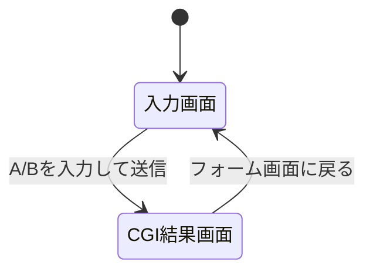

# 外部設計書

## 1. 文書情報

| 項目 | 内容 |
| --- | --- |
| システム名 | azure_c_calc-app |
| 目的 | HTMLフォームからC言語CGIへリクエストを送信し、Webブラウザで結果を表示する |
| 対象環境 | Apache CGIを有効化したAzure VM |
| 現行版の位置づけ | CGIのGETパラメータ受信確認版 |

## 2. システム構成

```mermaid
flowchart LR
    User[利用者のブラウザ] -->|GET /| Apache[Apache HTTP Server]
    Apache -->|静的配信| Index[public/index.html]
    User -->|GET /cgi-bin/calc.cgi?a=10&b=20| Apache
    Apache -->|CGI起動| Calc[/usr/lib/cgi-bin/calc.cgi]
    Calc -->|HTMLレスポンス| Apache
    Apache --> User
```

## 3. 画面仕様

### 3.1 入力画面

| 項目 | 仕様 |
| --- | --- |
| URL | `/` |
| ファイル | `public/index.html` |
| 入力項目 | 数値 A、数値 B |
| 初期値 | A=`10`、B=`20` |
| 必須 | HTMLの `required` 属性で必須入力 |
| 送信先 | `/cgi-bin/calc.cgi` |
| HTTPメソッド | GET |

### 3.2 CGI結果画面

| 項目 | 仕様 |
| --- | --- |
| URL | `/cgi-bin/calc.cgi` |
| Content-Type | `text/html; charset=utf-8` |
| 表示内容 | リクエストメソッド、`QUERY_STRING` の有無と値 |
| 戻るリンク | `/` |

現行版では A と B の加減乗除結果は計算・表示しない。計算機能は次版以降の拡張対象とする。

## 4. 画面遷移



## 5. 非機能要件

| 分類 | 要件 |
| --- | --- |
| 可用性 | Apache、CGI設定、コンパイル済みCGIが稼働していること |
| 性能 | 小規模な学習・検証用途を想定する |
| セキュリティ | SSH秘密鍵はGitHub Secretsで管理し、リポジトリへ登録しない |
| 保守性 | ローカルでビルド・検証後、GitHub ActionsからAzure VMへデプロイする |

## 6. 前提・制約

- Azure VMはLinux、Apache、gcc、CGI実行環境を備える。
- `/var/www/html` と `/usr/lib/cgi-bin` はAzure VM上の配置先である。
- `deploy.sh` はAzure VM上で実行する。
- ローカル環境ではAzure VMのシステム領域へ直接コピーしない。