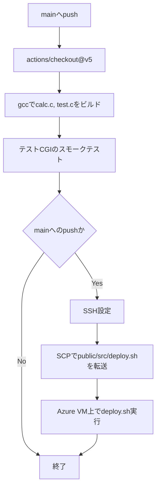

# 内部設計書

## 1. 構成

```text
azure_c_calc-app/
├── .github/c-cpp.yml   GitHub Actionsのビルド・デプロイ定義
├── docs/               設計・運用ドキュメント
├── public/index.html   入力画面
├── src/calc.c          GETパラメータ表示用CGI
├── src/test.c          CGI実行確認用プログラム
├── deploy.sh           Azure VM内での配置スクリプト
└── README.md           プロジェクト概要
```

## 2. 処理方式

### 2.1 入力画面

1. Apacheが `/var/www/html/index.html` を静的ファイルとして返す。
2. 利用者が A と B を入力する。
3. ブラウザが `/cgi-bin/calc.cgi?a=<A>&b=<B>` へGETリクエストを送信する。

### 2.2 `calc.cgi`

1. `Content-Type` ヘッダーを出力する。
2. `REQUEST_METHOD` 環境変数を取得する。
3. `QUERY_STRING` 環境変数を取得する。
4. 値が存在する場合はHTMLへ表示する。
5. 入力画面への戻りリンクを出力して終了する。

現行実装はクエリ文字列を解析していない。将来、計算処理を追加する場合は、URLデコード、数値変換、入力値検証、ゼロ除算対策を追加する。

## 3. ビルド仕様

```bash
gcc -Wall -Wextra -Werror src/calc.c -o calc.cgi
gcc -Wall -Wextra -Werror src/test.c -o test.cgi
```

生成物は実行ファイルであり、リポジトリへコミットしない。

## 4. デプロイ仕様

`deploy.sh` は次の処理を順に実行する。

1. `public/*` を `/var/www/html/` へコピーする。
2. `src/calc.c` を `calc.cgi` としてコンパイルする。
3. `calc.cgi` を `/usr/lib/cgi-bin/` へ移動する。
4. CGIに実行権限を付与する。

スクリプトはプロジェクトルートで実行する。GitHub Actionsからは `cd ~/azure_c_calc-app && ./deploy.sh` として実行する。

## 5. CI/CD設計



### GitHub Secrets

| Secret | 用途 |
| --- | --- |
| `AZURE_VM_HOST` | Azure VMのホスト名またはIPアドレス |
| `AZURE_VM_USER` | SSH接続ユーザー |
| `AZURE_VM_SSH_KEY` | SSH秘密鍵 |

## 6. エラー方針

- コンパイル失敗時はジョブを失敗させ、デプロイしない。
- スモークテスト失敗時はジョブを失敗させ、デプロイしない。
- SSH、SCP、リモートのデプロイ失敗時はGitHub Actionsを失敗させる。
- `deploy.sh` は `set -e` により途中失敗時に終了する。